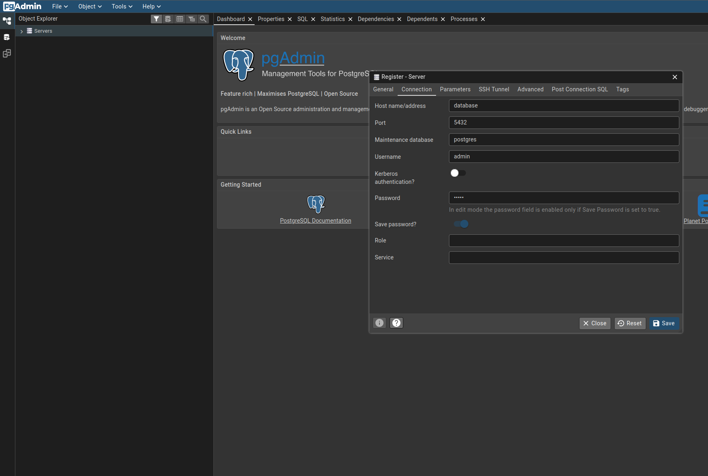
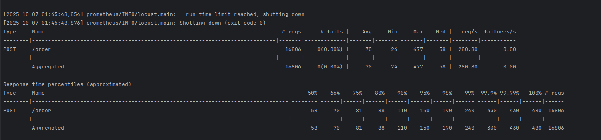
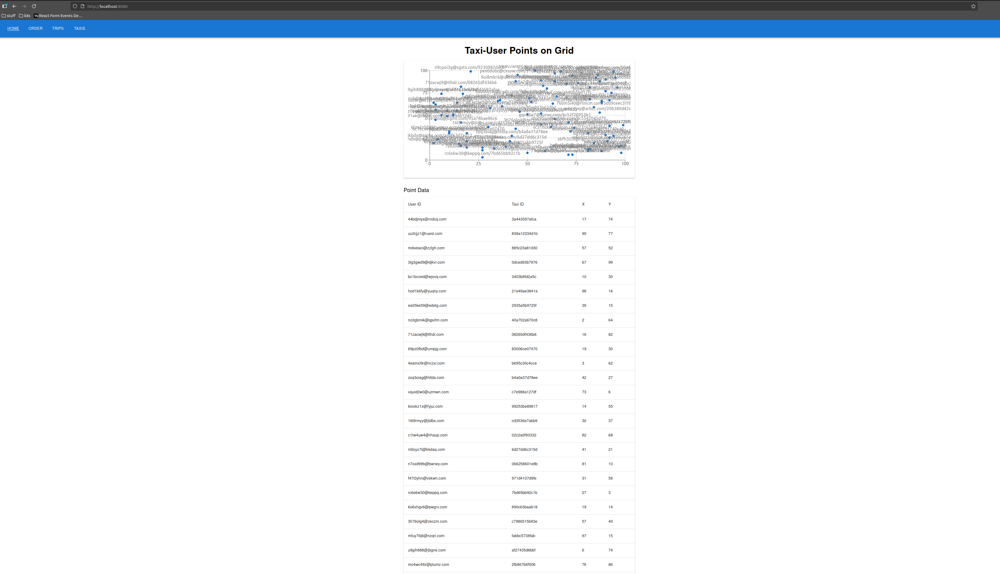

# Taxi dispatcher (REST)

## Structure
- `postgres` subdir contains `docker-compose` files for running PostgreSQL database
- `stress_test` subdir  contains `locust` script for load testing the API
- `taxi_be` contains dispatcher service sources - the actual application event-driven backend
- `taxi_fe` contains a very basic `react` frontend acting as a *management dashboard* for the application
- `taxi_worker` contains the actual worker script that simulates a taxi vehicle

## Required software
- `python 3.11` see [pyenv](https://github.com/pyenv/pyenv)
- [docker & docker compose](https://docs.docker.com/compose/install/) (version 2.20.3 or [later](https://docs.docker.com/compose/how-tos/multiple-compose-files/include/)) or [podman desktop](https://podman-desktop.io/downloads) (requires adding bash aliases for docker and docker-compose)
- [optional] node v22 lts see [nvm](https://github.com/nvm-sh/nvm)

## Virtual environment
To create isolated python virtual environment please run (linux):
```bash
python3 -m venv .venv
source .venv/bin/activate
```

## Install dependencies
This project uses pip along with bash script to install dependencies (although poetry could be used as well).
Dependency installation script is located in the [repo root](./install_pip.bash).
Please run the script using a bash shell with `python 3.11` virtual environment already activated.

## Run docker-compose
`docker-compose.yaml` file utilizes [.env](.env) file that can be adjusted as needed. 
To start the application please run (inside the repository root):
Postgres and PgAdmin credentails can be defined in [postgres/.dotenv](postgres/.dotenv).

```bash
docker compose up # note: docker compose, not docker-compose !
```

To shut down the application and remove containers please run
```bash
docker compose down
sudo rm -rf db-data/ pgadmin-data/ # cleanup db data
```

# pg_admin
Can be accessed at http://localhost:15433, credentials are set inside [postgres/.dotenv](postgres/.dotenv).


```bash
sudo apt install postgresql-client-common
sudo apt install postgresql-client-16 # or postgresql-client-14

psql -U usr -h localhost -p 15432 taxi_db
```
User password can be found in [postgres/db_init.sql](postgres/db_init.sql).


## Run API stress tests
API service is exposed on port 8000 in `docker-compose.yaml`, `locust` stress test should be run with the following command
on the machine running `docker-compose` (with previously activated virtual environment).

(wait statements in `api_stress_test.py` have been commented out intentionally)

```bash
cd stress_test
locust -f api_stress_test.py --headless -u 20 -r 5 --run-time 1m
```

Stress test results for 100 workers (total RAM was below 16 GB during the test, including IDE)


Frontend app during stress tests
