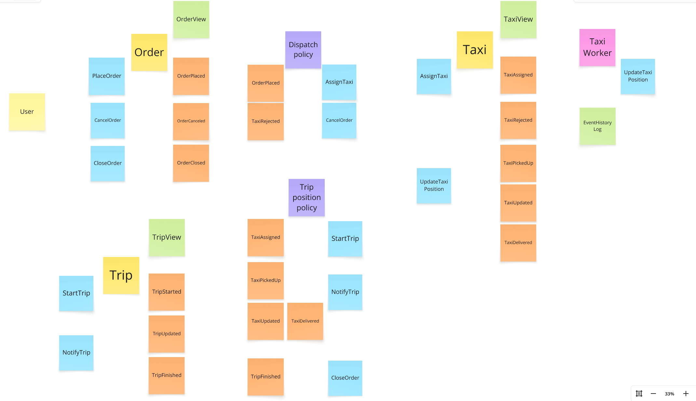

# Taxi dispatcher (REST)

### Initial design
The design process was conducted using modified version of *Event Storming* method described [on this page](https://www.avanscoperta.it/en/eventstorming/),
please also see a book by [Alberto Brandolini](https://leanpub.com/introducing_eventstorming).

###  Legend

### Event storming design (last phase)
The following picture shows the last design phase where aggregates and policies have
commands (inputs) and events (outputs) attached (event and command cards were duplicated next to relevant cards for improved readability).

Additionally, images above are exported to [this pdf document](./docs/es_taxi_be.pdf).


### ADR 0.0.1 (architecture decision record)
Developing event driven handlers with dedicated domain model objects requires significant amount of boilerplate code and at least a simple event bus or queueing system to be added.
Since `/order` endpoint is synchronous, for this simple system a decision was made to implement aggregate logic in the data model classes. This can be easily changed and a dedicated domain model classes can be created and mapped from the data model as the system complexity increases.


## Structure
- `postgres` subdir contains `docker-compose` files for running PostgreSQL database
- `stress_test` subdir  contains `locust` script for load testing the API
- `taxi_be` contains dispatcher service sources - the actual application event-driven backend
- `taxi_fe` contains a very basic `react` frontend acting as a *management dashboard* for the application
- `taxi_worker` contains the actual worker script that simulates a taxi vehicle

## Required software
- `python 3.11` see [pyenv](https://github.com/pyenv/pyenv)
- [docker & docker compose](https://docs.docker.com/compose/install/) (version 2.20.3 or [later](https://docs.docker.com/compose/how-tos/multiple-compose-files/include/)) or [podman desktop](https://podman-desktop.io/downloads) (requires adding bash aliases for docker and docker-compose)
- [optional] node v22 lts see [nvm](https://github.com/nvm-sh/nvm)

## Virtual environment
To create isolated python virtual environment please run (linux):
```bash
python3 -m venv .venv
source .venv/bin/activate
```

## Install dependencies
This project uses pip along with bash script to install dependencies (although poetry could be used as well).
Dependency installation script is located in the [repo root](./install_pip.bash).
Please run the script using a bash shell with `python 3.11` virtual environment already activated.

```bash
# ensure virtual environment is activated before running script
./install_pip.bash 
```

## Run docker compose
`docker-compose.yaml` file utilizes [.env](.env) file that can be adjusted as needed. 
To start the application please run (inside the repository root):
Postgres and PgAdmin credentails can be defined in [postgres/.dotenv](postgres/.dotenv).

```bash
docker compose up # note: docker compose, not docker-compose !
```

To shut down the application and remove containers please run
```bash
docker compose down
sudo rm -rf db-data/ pgadmin-data/ # cleanup db data
```

# pg_admin
Can be accessed at http://localhost:15433, credentials are set inside [postgres/.dotenv](postgres/.dotenv).


```bash
sudo apt install postgresql-client-common
sudo apt install postgresql-client-16 # or postgresql-client-14

psql -U usr -h localhost -p 15432 taxi_db
```
User password can be found in [postgres/db_init.sql](postgres/db_init.sql).


## Run API stress tests
API service is exposed on port 8000 in `docker-compose.yaml`, `locust` stress test should be run with the following command
on the machine running `docker-compose` (with previously activated virtual environment).

(wait statements in `api_stress_test.py` have been commented out intentionally)

```bash
# ensure virtual environment is activated before running locust
cd stress_test
locust -f api_stress_test.py --headless -u 20 -r 5 --run-time 1m
```

Stress test results for 100 workers (total RAM was below 16 GB during the test, including IDE)


Frontend app during stress tests - exposed at **http://localhost:8080**
